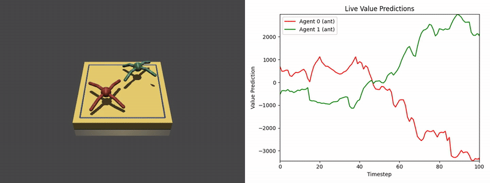

# RoboSumo-Torch

Modern PyTorch reimplementation of [OpenAI RoboSumo](https://github.com/openai/robosumo) - a multi-agent sumo wrestling environment for training competitive agents. Beyond, the original repo we also add a data rollout and PPO loop for RL training. NOTE: Checkpoints from the original repo are available and work in the current code-base, but a full train-from-scratch has not been tested (yet) due to compute constraints on the author.

## Features

- **Multi-agent sumo environment** with MuJoCo physics (Ant, Bug, Spider morphologies)
- **PPO training** with parallel rollouts for efficient data collection
- **Self-play** training against frozen opponents
- **MLP and LSTM policies** with observation normalization
- **Reward shaping** (win/lose rewards, push opponent, move to opponent)
- **Video recording** during training and evaluation
- **WandB integration** for experiment tracking
- **Checkpointing** for model saving/loading
- **Pre-trained policy zoo** with TensorFlow parameter conversion

